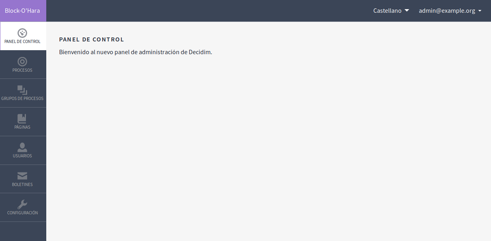
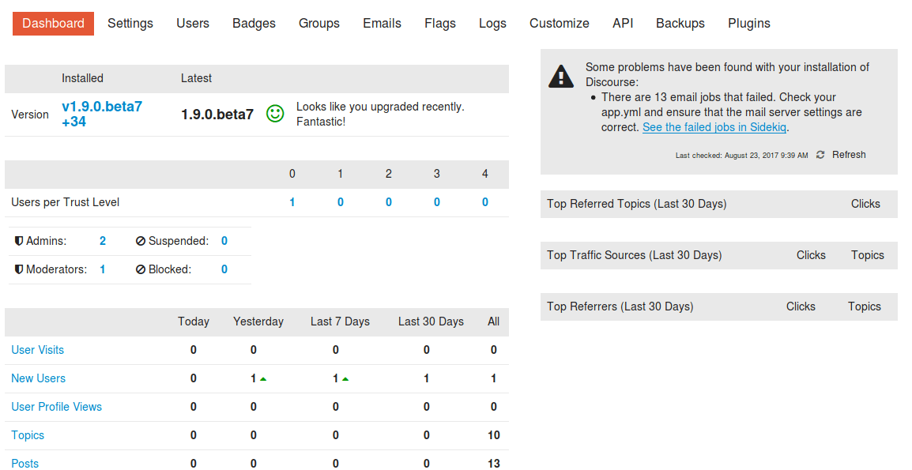
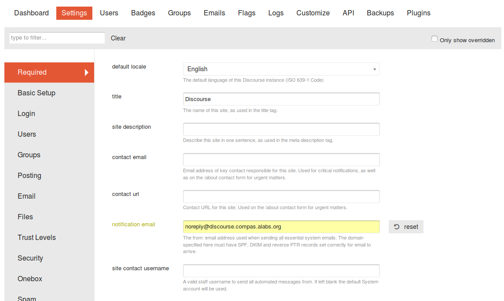
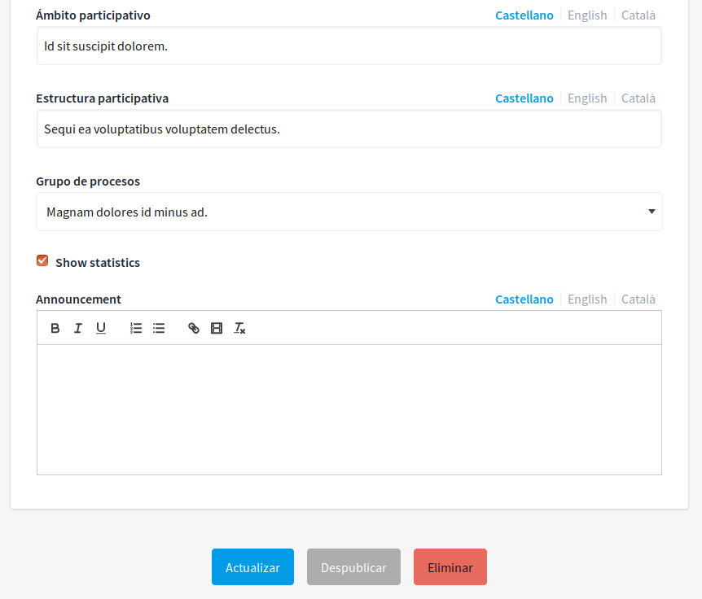
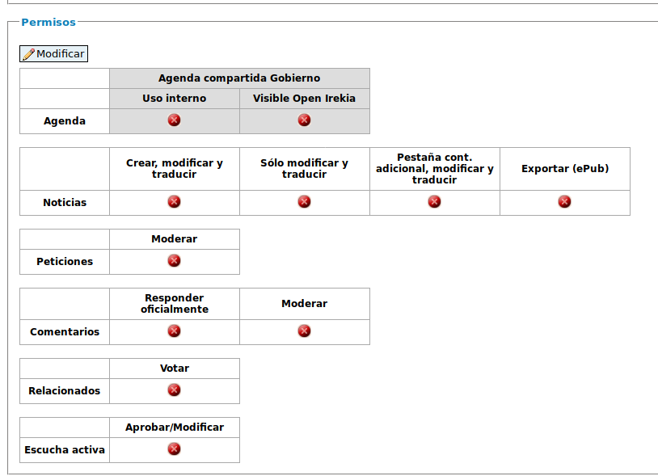
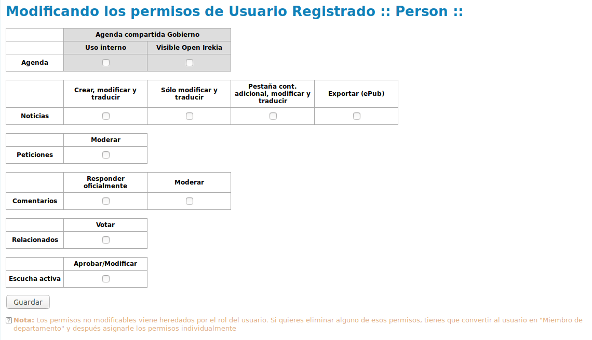
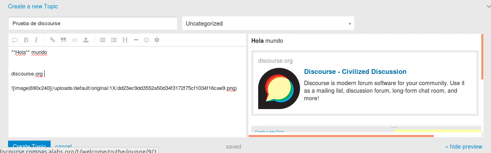

## Administración

### 1. Panel de control de administrador

Al acceder a Decidim como usuario administrador el panel de control no contiene ningún tipo de información de actividad de la plataforma: 

**Figura A.1.30 (A.1 Decidim):** Administrador - Panel de control 

De cara a facilitar la revisión y moderación de contenidos nuevos así como de información general de la plataforma se recomienda tener una serie de metadatos similares a los disponibles en Discourse: 

**Figura D.1.23 (D.1 Discourse):** Administrador: Panel de control

### 2. Ayudas contextuales en Administrador

De cara a comprender mejor cada opción del administrador, en Decidim se echa en falta la explicación de cada configuración disponible en dicho panel. 

Un buen ejemplo de cómo pueden explicarse esos valores es el utilizado para Discourse: 

**Figura D.1.24 (D.1 Discourse):** Administrador: Configuraciones

### 3. Traducciones faltantes 

Durante el análisis de Decidim se han encontrado una serie de campos en inglés sin traducción a las otras lenguas soportadas oficialmente (Catalán y Castellano). Esto genera problemas de usabilidad por parte de los administradores, ya que muchos pueden no saber inglés. Como ejemplo de estos fallos se encuentran los campos "Show statistics" y “Announcement”. 

**Figura A.1.34:** Administrador - Proceso Participativo - Información III

### 4. Granularidad de permisos 

De cara a facilitar la adaptación por parte de otras entidades, con otro tipo de necesidades, se echa en falta un sistema de permisos por acciones, en el que se pueda configurar qué es lo que pueda realizar cada rol de usuario. Un buen ejemplo de esta interfaz es la de Open Irekia, donde se presenta una matriz de estos permisos que son, además, personalizables. 

**Figura A.2.17 (A.2 Open Irekia): **Permisos de usuarios

**Figura A.2.18 (A.2 Open Irekia): **Modificación de permisos de usuarios

### 5. Mejoras en sistema de newsletter

**Figura D.1.43 (D.1 Discourse):** Formulario de publicación de entradas II

