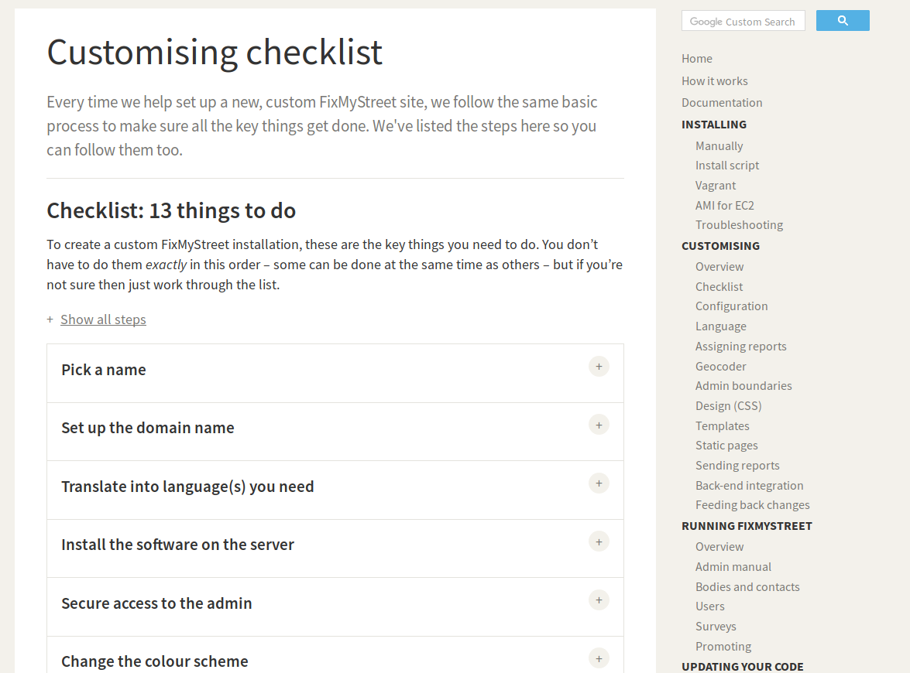

## Documentación

### 1. Documentación funcional de puesta en producción

Un aspecto a destacar de la mayoría de las aplicaciones hechas por mySociety (FixMyStreet (NOTE:  http://fixmystreet.org/customising/checklist/ ), Alaveteli (NOTE:  http://alaveteli.org/docs/getting_started/) y Pombola) es el uso de documentación tanto técnica como funcional. Por ejemplo entre las instrucciones que dan de personalización ofrecen una lista de tareas a comprobar, cómo por ejemplo formar el grupo impulsor, escoger el nombre de la plataforma, su dominio, traducir al idioma, instalar la aplicación, adaptar la imagen, etc. 

**Figura F.2.36 **** (Anexo F.2 Aleveteli)****:** Documentación: como personalizar la instalación 

