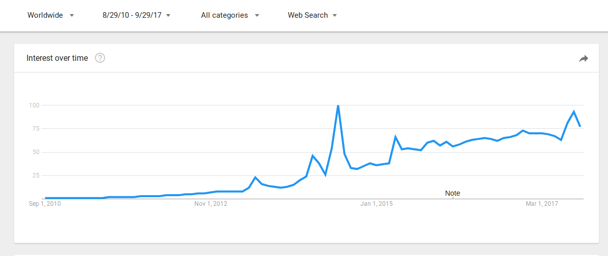

## User Engagement

### 1. Responder por correo electrónico 

De cara a mejorar la participación de los usuarios en la plataforma (user engagement) se recomienda desarrollar una funcionalidad que permita a los usuarios seguir participando en un hilo desde el propio correo electrónico, como lo realizan Discourse y Loomio. 

### 2. Emojis 

Son caracteres popularizados por los smartphones, que se encuentran disponibles en múltiples aplicaciones (Gmail, Facebook, Twitter, Whatsapp, Telegram, Google Hangouts) y que permiten comunicar expresiones faciales, objetos, lugares, etc. 

Son elementos que tienen cada vez más relevancia tanto a nivel técnico como cultural, siendo incluso un emoji () la palabra del Año 2015 según el diccionario Oxford[^1]. Así mismo cuentan con una clara tendencia ascendente según el servicio Google Trends que permite analizar términos de búsqueda en Google[^2]. 

**Figura 7:** Evolución del interés de Emojis en Google Trends

Entre las aplicaciones analizadas en este informe, Loomio ya cuenta con ellos y 

Your Priorities lo tiene en su plan de desarrollo. En el caso de Discourse incluso se pueden agregar Emojis personalizados. 

**Figura D.2.11 (D.2 Loomio): **Emojis en comentarios

[^1]: http://blog.oxforddictionaries.com/2015/11/word-of-the-year-2015-emoji/
[^2]: https://www.google.es/trends/explore#q=emoji&date=1%2F2011%2072m&cmpt=q&tz=Etc%2FGMT-2
